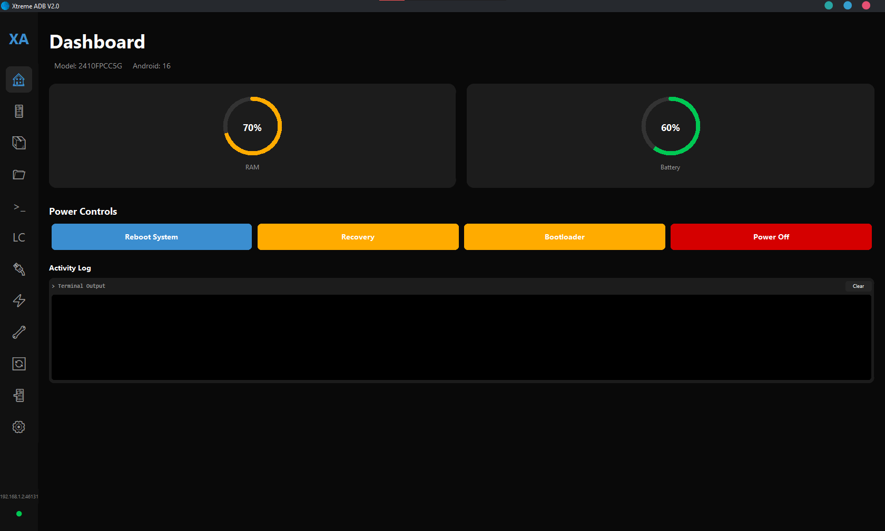
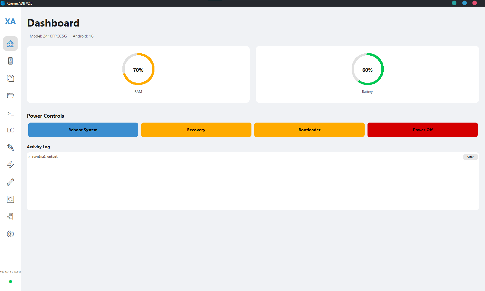

  

<h1 align="center">Xtreme ADB</h1>

  
  
  
  

**The Ultimate All-in-One Android Toolkit.**
Xtreme ADB is An App That Helps You To Use Android debuging bridge easier By Using Graphical Interface.

---

## DISCLAIMER & WARNINGS

### Critical Warnings:
1.  **Fastboot Mode:** The "Fastboot Tools" section allows you to flash images (`recovery.img`, `boot.img`) and unlock your bootloader. **Improper use of these features CAN brick your device.** Do not use these buttons unless you understand exactly what you are doing.
2.  **Root Features:** Some features (like extracting protected APKs or modifying system flags) may require Root access.
3.  **Data Loss:** Unlocking a bootloader usually wipes all user data. **Always backup your data** before performing advanced operations.
4.  **Drivers:** Ensure you have the correct USB Drivers installed for your specific phone brand.

---

## Features

*   **Modern UI:** A clean design with full Light/Dark mode support.
*   **Live Dashboard:** Real-time monitoring of Battery and RAM.
*   **App Manager:** Bulk install APKs, uninstall system apps, force stop, and extract APKs to PC.
*   **File Explorer:** Full GUI file manager to Copy, Paste, Rename, Delete, Upload, and Download files.
*   **Fastboot & Recovery:** Boot live images without flashing, flash recovery/boot, and sideload ZIPs.
*   **Wireless ADB:** Built-in pairing tool for Android 11+ (Pairing Code support) and TCP/IP toggler.
*   **Tweaks:** Change DPI, Resolution, Animation Scales, and toggle visual pointers.
*   **Backup & Restore:** Create full system backups (`.ab` files) and restore them.
*   **Logcat:** Color-coded (*In Dark Mode only) real-time log stream to easily spot errors.

---

## Screenshots

  

  

---

## Installation & Usage

### Prerequisites
1.  **Python 3.10+**: [Download Here](https://www.python.org/)
2.  **Libraries**: Can Be Installed with the command `pip install -r requirments.txt`
3.  **ADB & Fastboot**: Must be installed and added to your system `PATH`. [Google Platform Tools](https://developer.android.com/studio/releases/platform-tools)

### Setup
**You can download latest release executable instead of the python script Or:**
1.  Open your terminal/command prompt.
2.  Clone this repo: `git clone https://github.com/KPR-MAN/XtremeADB`
3.  Install the required libraries: `pip install -r requirments.txt`
4.  Run the tool: `python xadb.py`

---

## Troubleshooting

*   **"No Device" is shown:**
    *   Ensure your cable is good.
    *   Ensure ADB drivers are installed for your specific phone.
    *   Try running `adb kill-server` and `adb start-server` in a separate terminal.
*   **App Freezes:**
    *   The app has a timeout to prevent freezing, but if it hangs, the ADB connection might be unstable. Reconnect the USB cable.

---

## License & Credits

**License: MIT (Modified for Attribution)**

You are free to:
*   Use this software for personal or commercial use.
*   Modify the source code.
*   Distribute or Fork this project.

**Under the following condition:**
*   **Attribution Required:** You **MUST** give appropriate credit to the original author in your software, documentation, or repository. For example: `Based on Xtreme ADB by KPR-MAN (https://github.com/KPR-MAN/XtremeADB)`.

---

**Made With ❤️ By [KPR-MAN](https://github.com/KPR-MAN/XtremeADB).**
